# Android CameraX的基础使用

## 添加 Gradle 依赖
打开项目的模块（Module）的build.gradle 文件，并添加 CameraX 依赖项：

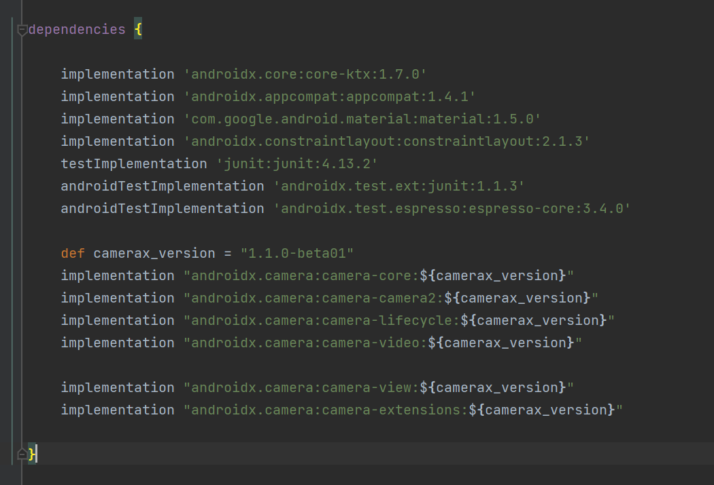  

CameraX 需要一些属于 Java 8 的方法，因此需要相应地设置编译选项（实际上比较新的Android Studio版本会默认设置）。在 android 代码块的末尾，紧跟在 buildTypes 之后，添加以下代码：

因为在项目中使用了ViewBinding，在 android{} 代码块末尾添加如下代码：

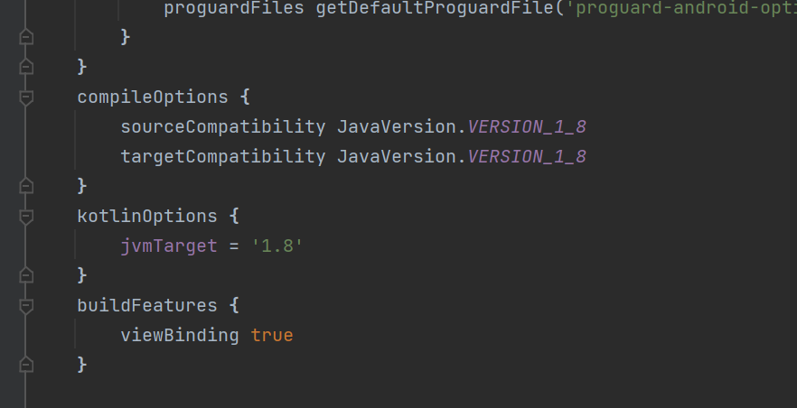  

## 创建项目布局
本项目中，涉及以下的功能：

CameraX PreviewView（用于预览相机图片/视频）。
用于控制图片拍摄的标准按钮。
用于开始/停止视频拍摄的标准按钮。
用于放置 2 个按钮的垂直指南。
打开res/layout/activity_main.xml 的 activity_main 布局文件，并将其替换为以下代码。

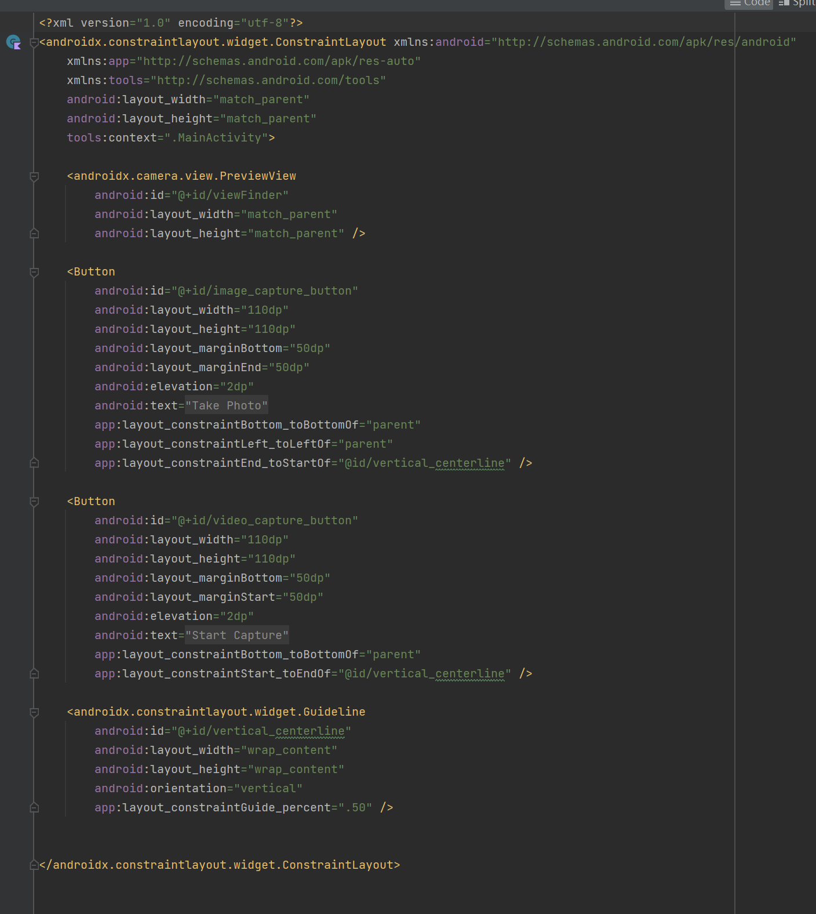  

更新res/values/strings.xml 文件

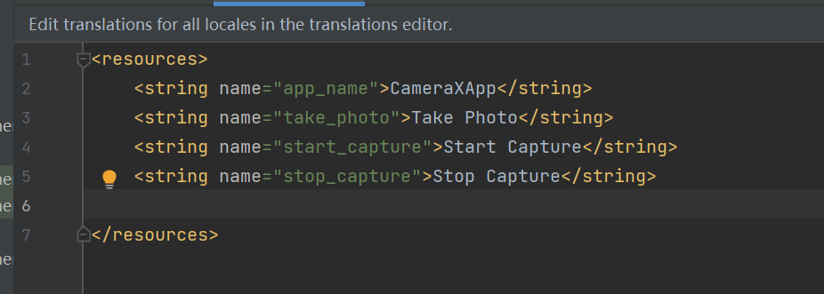  

## 编写 MainActivity.kt 代码
将 MainActivity.kt 中的代码替换为以下代码，但保留软件包名称不变。它包含 import 语句、将要实例化的变量、要实现的函数以及常量。

系统已实现 onCreate()，供我们检查相机权限、启动相机、为照片和拍摄按钮设置 onClickListener()，以及实现 cameraExecutor。虽然系统已经实现 onCreate()，但在实现文件中的方法之前，相机将无法正常工作。

## 请求必要的权限
应用需要获得用户授权才能打开相机；录制音频也需要麦克风权限；在 Android 9 § 及更低版本上，MediaStore 需要外部存储空间写入权限。在此步骤中，我们将实现这些必要的权限。

打开 AndroidManifest.xml，然后将以下代码行添加到 application 标记之前。
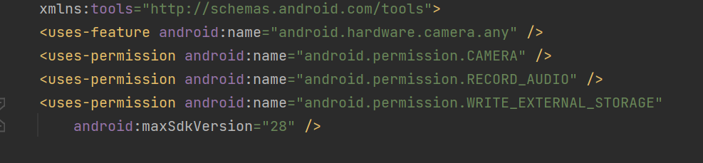  

添加 android.hardware.camera.any 可确保设备配有相机。指定 .any 表示它可以是前置摄像头，也可以是后置摄像头。

然后，复制代码到MainActivity.kt. 中。

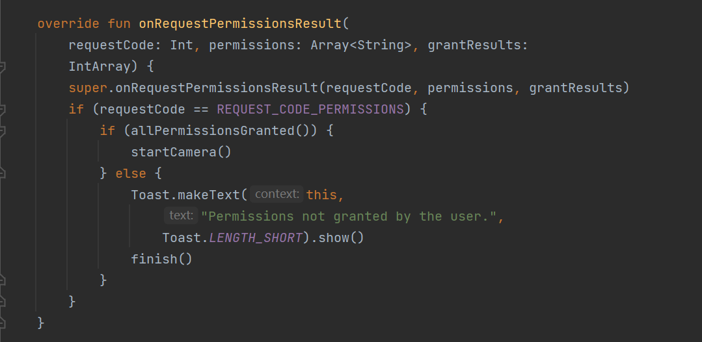  

## 实现 Preview 用例
在相机应用中，取景器用于让用户预览他们拍摄的照片。我们将使用 CameraX Preview 类实现取景器。

如需使用 Preview，首先需要定义一个配置，然后系统会使用该配置创建用例的实例。生成的实例就是绑定到 CameraX 生命周期的内容。填充之前的startCamera() 函数

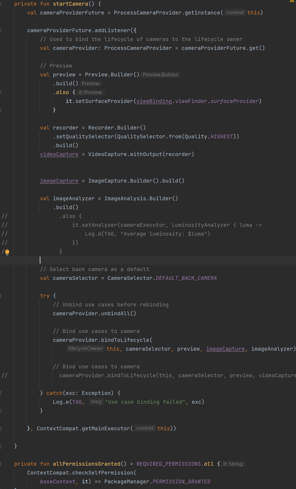  

最后，运行应用，可以看到相机预览

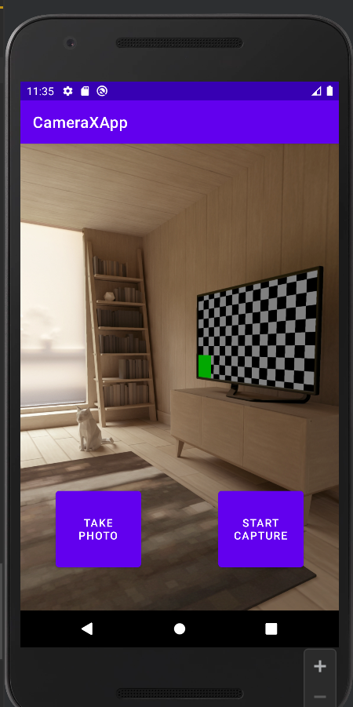  

## 实现 ImageCapture 用例（拍照功能）
其他用例与 Preview 非常相似。首先，定义一个配置对象，该对象用于实例化实际用例对象。若要拍摄照片，需要实现 takePhoto() 方法，该方法会在用户按下 photo 按钮时调用。填充takePhoto() 方法的代码：

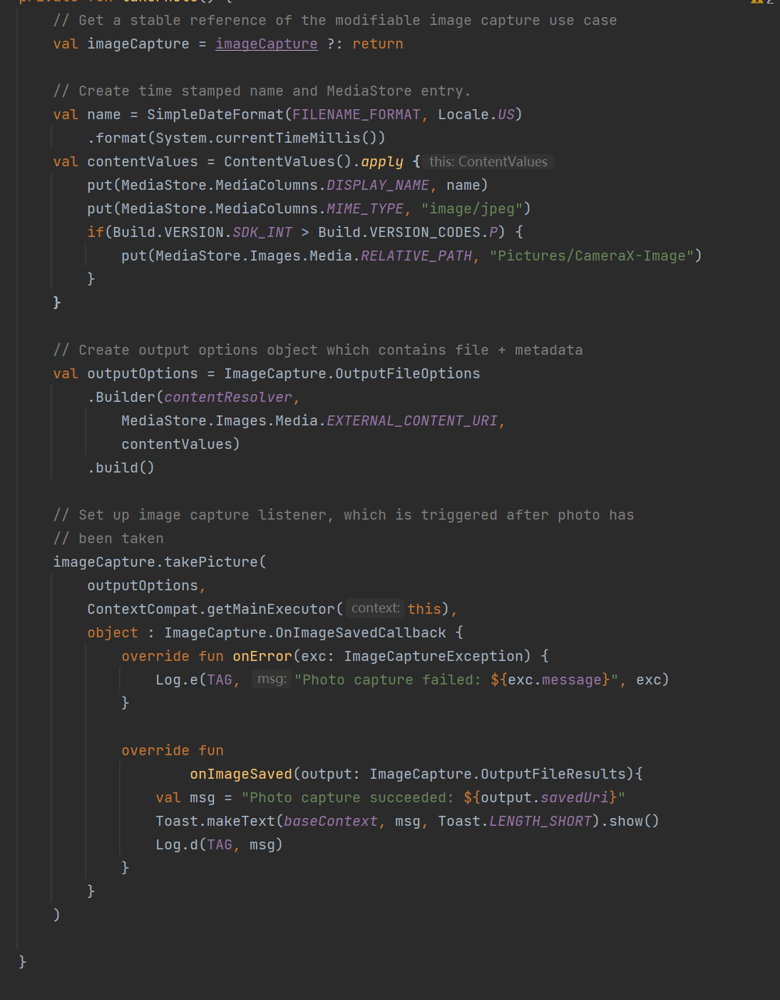  

重新运行应用，然后按 Take Photo。屏幕上应该会显示一个消息框，会在日志中看到一条消息。

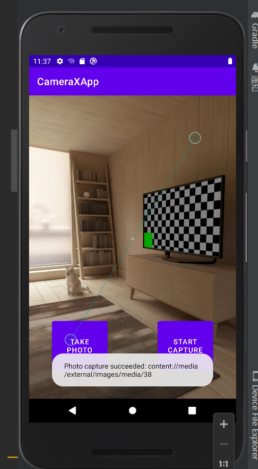  

这时可以查看本地的图片库，查看刚刚拍摄的图片。

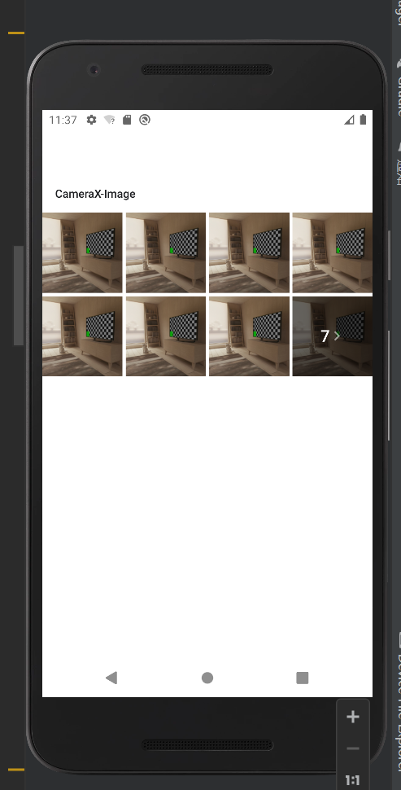  

## 实现 ImageAnalysis 用例
使用 ImageAnalysis 功能可让相机应用变得更加有趣。它允许定义实现 ImageAnalysis.Analyzer 接口的自定义类，并使用传入的相机帧调用该类。无需管理相机会话状态，甚至无需处理图像；与其他生命周期感知型组件一样，仅绑定到应用所需的生命周期就足够了。

将此分析器添加为 MainActivity.kt 中的内部类。分析器会记录图像的平均亮度。如需创建分析器，我们会替换实现 ImageAnalysis.Analyzer 接口的类中的 analyze 函数。

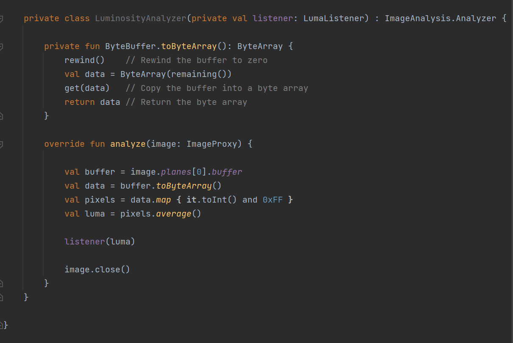  

在类中实现 ImageAnalysis.Analyzer 接口后，只需在 ImageAnalysis中实例化一个 LuminosityAnalyzer 实例（与其他用例类似），并再次更新 startCamera() 函数，然后调用 CameraX.bindToLifecycle() 即可：

接下来更新startCamera()，将以下代码添加到 imageCapture 代码下方。

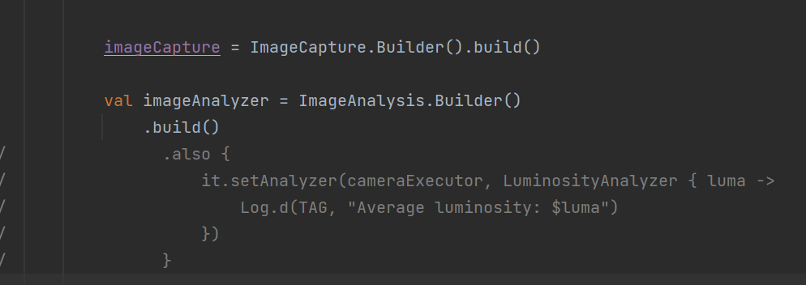  

更新 cameraProvider 上的 bindToLifecycle() 调用，以包含 imageAnalyzer。

立即运行应用！它会大约每秒在 logcat 中生成一个类似于下面的消息。

D/CameraXApp: Average luminosity: ...

## 实现 VideoCapture 用例（拍摄视频）
CameraX 在 1.1.0-alpha10 版中添加了 VideoCapture 用例，并且从那以后一直在改进。注意，VideoCapture API 支持很多视频捕获功能，因此，为了使此项目易于管理，仅演示如何在 MediaStore 中捕获视频和音频。

将以下代码复制到captureVideo() 方法：该方法可以控制 VideoCapture 用例的启动和停止。

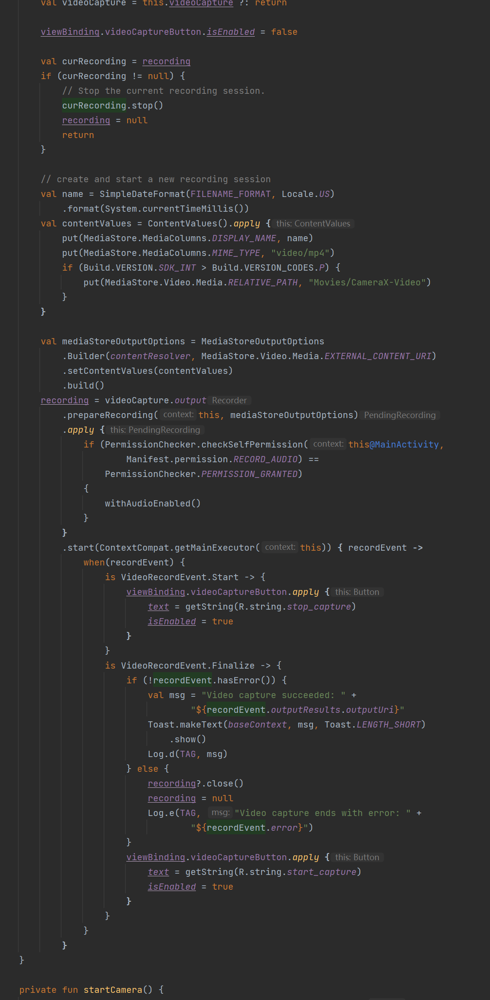  

构建并运行项目。
录制一些剪辑：
按“START CAPTURE”按钮。注意，图片说明会变为“STOP CAPTURE”。
录制几秒钟或几分钟的视频。
按“STOP CAPTURE”按钮（和 start capture 按钮是同一个按钮）。
视频录制测试可以看到视频被成功保存至媒体库。
