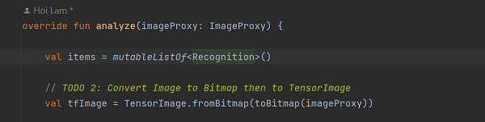

# 使用TensorFLow Lite模型制作器和Android Studio ML模型绑定来识别花朵

## 介绍

这个测试版代码实验室介绍了使用TensorFlow Lite ModelMaker和Androidstudio4.1Beta 1或更高版本的最新工具。此外，它将需要访问物理Android设备进行测试。如果您更喜欢使用这个代码实验室的稳定版本，请使用这个代码实验室。

## 向应用中添加TensorFlow Lite

  

## 检查代码中的TODO项

本项目初始代码中包括了若干的TODO项，以导航项目中未完成之处。为了方便起见，首先查看TODO列表视图，View>Tool Windows>TODO

  

默认情况下了列出项目所有的TODO项，进一步按照模块分组（Group By）

  

## 添加代码重新运行APP

1.定位“start”模块MainActivity.kt文件的TODO 1，添加初始化训练模型的代码
  

2.在CameraX的analyze方法内部，需要将摄像头的输入ImageProxy转化为Bitmap对象，并进一步转化为TensorImage 对象
  

3.对图像进行处理并生成结果，主要包含下述操作：

按照属性score对识别结果按照概率从高到低排序列出最高k种可能的结果，k的结果由常量MAX_RESULT_DISPLAY定义

  

4.将识别的结果加入数据对象Recognition 中，包含label和score两个元素。后续将用于RecyclerView的数据显示
  

5.将原先用于虚拟显示识别结果的代码注释掉或者删除

  

6.以物理设备重新运行start模块

7.最终运行效果

  

  

  

  

  
